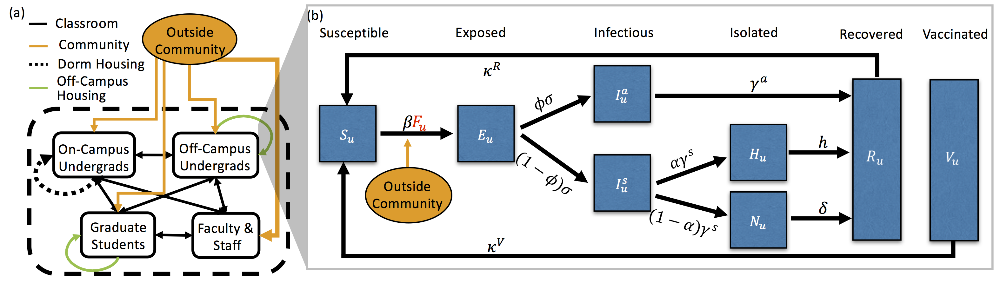

# Global Sensitivity Analysis (GSA) of Covid-19 Transmission on a University Campus
All code is written in MATLAB R2021b

Covid-19 model and transmission dynamics  

-----------
Directories
-----------
1)	contact_matrices/
> Folder contains the contact matrices for both campus contacts and dorm 
  living contacts under different classroom and dorm capacity scenarios. 
  The following key indicates the specifics of each contact scenario based 
  on a case number 1 through 24. 

2)	model_sols/
> Model solutions created by the script fun_compute_model_solutions.m are 
  saved in this folder.

3)	sobol_indices_dt/
> Sobol indices computed using the doubling time metric, with the script 
  compute_sobol_indices_doubling_time.m, are saved to this folder.

4)	sobol_indices_in_time/
> Sobol indices computed in time, using the cumulative number of cases 
  computed with the script compute_sobol_indices_over_time.m are saved to 
  this folder.

-------
Scripts
-------
1)	compute_sobol_indices_doubling_time.m
> Computes the first and total-effect Sobol indices using the disease 
  doubling time metric (see fun_doubling_time.m) and model solutions found 
  in the model_sols/ folder. The sobol indices are saved in the 
  sobol_indices_dt/ folder.

2)	compute_sobol_indices_in_time.m
> Computes the first and total-effect Sobol indices using the cumulative 
  number of cases (see fun_sobol_indices_by_solution_in_time.m) and the 
  model solutions found in the model_sols/ folder. The resulting sobol 
  indices are saved in the sobol_indices_in_time/ folder.

3)  RUN_ME.m
> Shows examples of how to run the code to produce model solutions,
  perform the Sobol analysis and produce plots.

---------
Functions
---------
1)	fun_compute_model_solutions.m
> Computed model solutions for particular contact scenarios 
  (see contact_matrices) and model parameter ranges 
  (see fun_model_parameter_ranges.m). All solutions are saved in the 
  model_sols/ folder. 

2)	fun_covid_model_ode.m
> SEIR model of disease transmission dynamics on a university campus. 
      This function is used by the compute_all_model_solutions.m script.

3)	fun_doubling_time.m
> Computes the disease doubling time over a desired number of consecutive 
  days since the start of a semester.

4)	fun_initialize_contact_matrices.m
> Combines contact matrices found in the contact_matrices/ folder into 
  arrays that can be accessed by case number (see Directories section). 

5)	fun_lhs_sampling_of_parameters.m
> Performs Latin hypercube sampling (lhs) of desired parameters in the 
  ranges specified in the fun_model_parameter_ranges.m function. Model 
  solutions are then computed using the sets of sampled parameter values.

6)	fun_model_parameter_ranges.m
> Stores the user indicated model parameters ranges and has a binary option
  for whether a parameter is to be varied (true) or not (false).

7)	fun_sobol_indices_by_measure.m
> Computes the first and total-effect Sobol indices using a measure 
  function that is applied to model solutions stored in the 
  model_solutions/ folder.

8)	fun_sobol_indices_by_solution_in_time.m
> Computes the first and total-effect Sobol indices using the model 
  solutions saved in the model_solutions/ folder.
